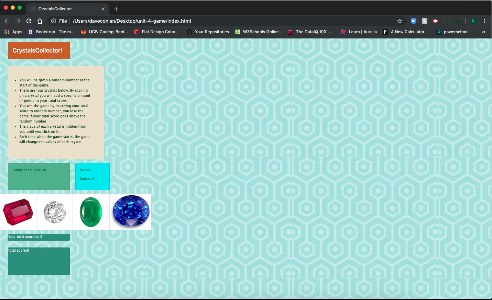
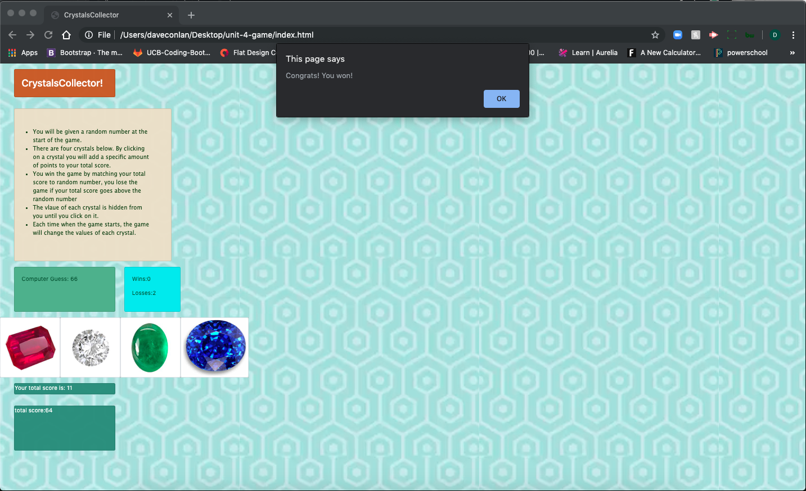
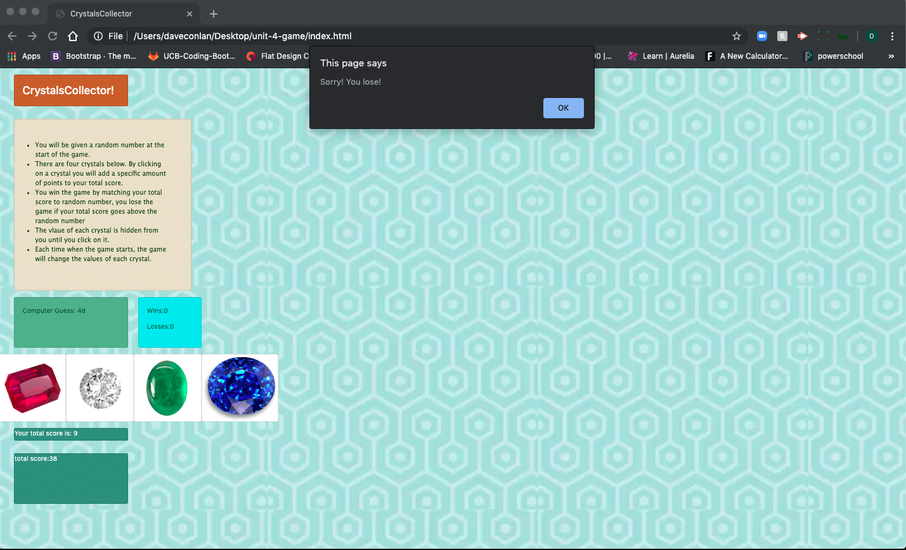

# unit-4-game

<b>This is a number guessing game against the computer.</b>

U.C. Berkeley Coding Bootcamp excersize #4. 

In this exersize, we came up with:

1. HTML coding to set the DOM ID's. 
2. .css coding to style each container; however, I leveraged bootstrap as well. 
3. .js coding to have the computer come up with a random number for itself, come up with four random numbers which are then associated to each of the crystals, a sum operation to add the randomly generated crystal numbers, and then a comparitive operation to match the computer generated number to the sum of the crytal number sets. After this, the user wins if the two numbers match or loses if they don't. Upon either a win or a loss, the game resets, but the score (whether a win or loss) is recorded. 

Here are some screenshots:

1. This is the screenshot of the game before playing. 

2. This is the screenshot of a win. 

3. This is the screenshot of a loss. 

<a href="https://dconlan1.github.io/unit-4-game/.index.html"> Play the game here!</a>
